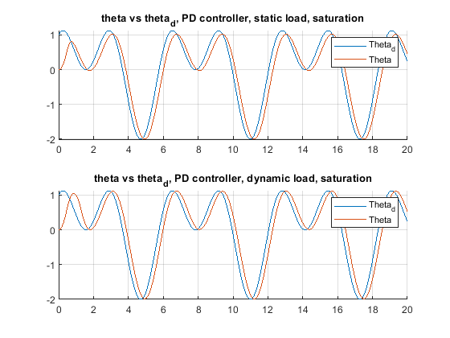
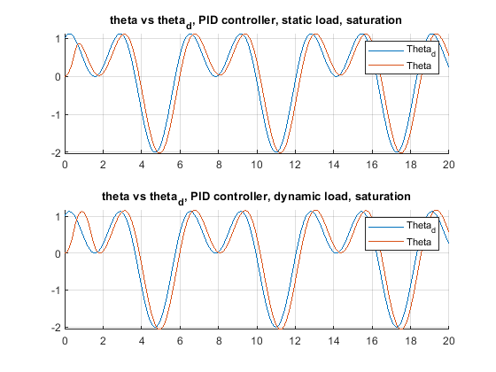

# Results, exercise 6, Magne Sirnes

Results obtained with:
 + zeta  = 1
 + omega = 9
 + K_i = 30

Could probably have tuned Ki even harder, but that led to some adverse effects with dynamic load.

Effect of saturation visible in initial transient from theta(t=0) = 0, otherwise control signal is well within bounds.

