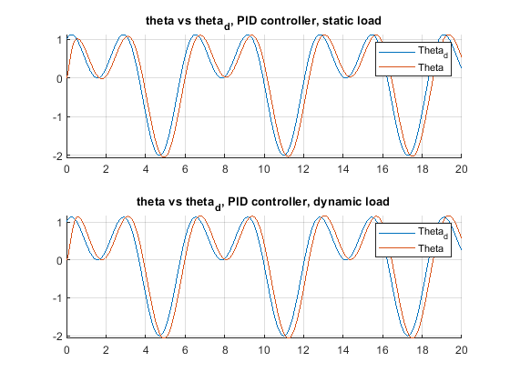

# Results, exercise 6, Magne Sirnes

Results obtained with:
 + zeta  = 1
 + omega = 9
 + K_i = 30

Could probably have tuned Ki even harder, but that led to some adverse effects with dynamic load.

