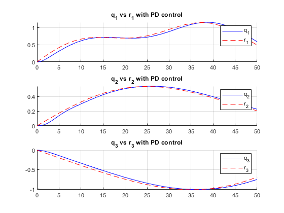
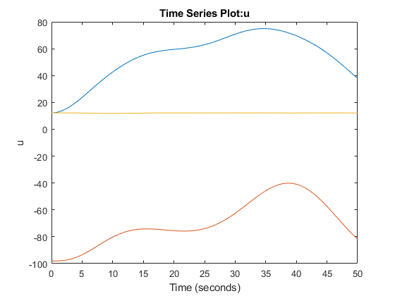
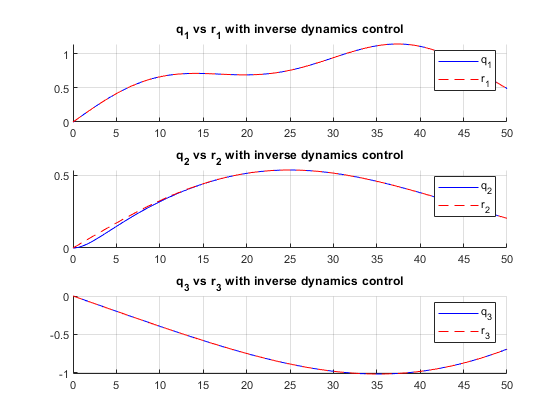
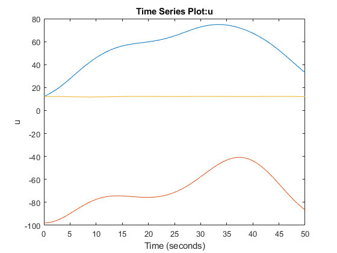

# Task 2, plots of results:

Response using PD control for each state, with gravity compensation, assumes rdot = 0.

Response using inverse dynamics control, using analytical expressions for entire reference vector. 

All tuning params can be found in appended MATLAB script.